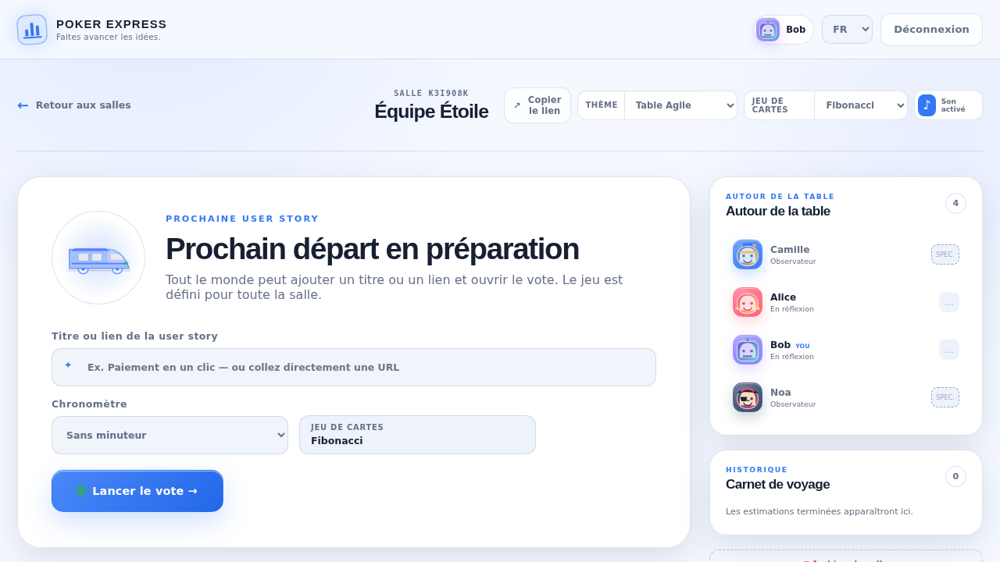

# Poker Express

Poker Express est une application de planning poker temps réel, bilingue et auto-hébergée. Elle fournit plusieurs jeux d’estimation, des salles indépendantes, un historique SQLite, des rôles votant/observateur et des réactions en direct.



## Choisir un déploiement

| Cible | Méthode | Stockage |
| --- | --- | --- |
| Serveur Linux, VM ou NAS | Docker Compose | Répertoire local `./data` |
| Kubernetes | Chart Helm | PVC `ReadWriteOnce` |
| AWS | Terraform + EC2 `t3.micro` | Volume gp3 chiffré |
| Poste développeur | Compose de développement | Répertoire local `./data` |

L’image officielle est `jeremygovi/planning-poker`. Utilisez un tag de version, par exemple `1.2.3`, pour un déploiement reproductible. Le tag `latest` suit la dernière release.

## Docker Compose

Prérequis : Docker avec le plugin Compose.

```sh
cp .env.sample .env
mkdir -p data
# Sous Linux, le conteneur non-root (UID 1000) doit pouvoir écrire dans ce dossier.
sudo chown -R 1000:1000 data
docker compose up -d
```

L’application écoute par défaut sur <http://127.0.0.1:3000>. Pour l’exposer derrière un reverse proxy, configurez `.env` :

```dotenv
BIND_ADDRESS=0.0.0.0
PORT=3000
DOCKER_TAG=1.2.3
PUBLIC_ORIGIN=https://poker.example.com
```

Commandes utiles :

```sh
docker compose logs -f
docker compose pull && docker compose up -d
docker compose down
make backup
```

La base SQLite se trouve dans `./data/poker-express.db`. La suppression ou le remplacement du conteneur ne supprime pas ce répertoire.

## Kubernetes avec Helm

Le chart nécessite une StorageClass capable de provisionner un volume persistant :

```sh
helm upgrade --install poker-express ./charts/poker-express \
  --namespace poker-express \
  --create-namespace \
  --set image.tag=1.2.3 \
  --set publicOrigin=https://poker.example.com \
  --set ingress.enabled=true \
  --set ingress.className=nginx \
  --set ingress.hosts[0].host=poker.example.com
```

Le chart crée par défaut un PVC de `1Gi` en `ReadWriteOnce`. Pour réutiliser un claim existant :

```sh
--set persistence.existingClaim=poker-express-data
```

Poker Express doit rester à **un replica** : les sessions et la présence sont en mémoire, tandis que SQLite ne doit être monté en écriture que par une instance. Le chart impose cette contrainte et utilise une stratégie de mise à jour `Recreate`.

## AWS EC2 avec Terraform

Le module [`terraform`](./terraform) déploie une instance Amazon Linux 2023, installe Docker et exécute l’image comme service `systemd`. Il ne clone pas le dépôt et n’installe pas Node.js. L’administration passe par AWS Systems Manager Session Manager ; aucun port SSH n’est ouvert.

```sh
cd terraform
cp terraform.tfvars.example terraform.tfvars
# Renseigner allowed_cidrs avec les adresses de votre entreprise ou VPN.
terraform init
terraform plan
terraform apply
```

`terraform output application_url` affiche l’URL et `terraform output ssm_start_session_command` la commande d’administration. Les données sont conservées dans `/opt/poker-express/data` sur le volume racine chiffré.

`t3.micro` est la valeur par défaut, mais sa gratuité dépend de l’ancienneté, des crédits et de la région du compte AWS. L’IPv4 publique, le stockage et le trafic peuvent également être facturés : vérifiez le plan Terraform et la tarification AWS avant l’application.

## Développement

Toutes les commandes de développement utilisent [`docker-compose-dev.yaml`](./docker-compose-dev.yaml) :

```sh
cp .env.sample .env
make dev        # Fastify et Vite avec rechargement automatique
make test       # tests unitaires, API, WebSocket et React
make e2e        # parcours Playwright multi-utilisateurs
make lint
make typecheck
make build      # image locale de production
```

Le serveur nécessite Node.js 24 uniquement si les commandes npm sont lancées directement sur l’hôte.

## CI, commits et releases

Chaque pull request exécute :

- Commitlint sur le titre et les commits de la PR ;
- TypeScript, ESLint, tests et build applicatif ;
- tests Playwright ;
- build de l’image de production ;
- validation des fichiers Compose, du chart Helm et de Terraform.

Les messages suivent [Conventional Commits](https://www.conventionalcommits.org/) :

```text
feat: add a new voting deck
fix: preserve room settings after restart
docs: clarify Kubernetes installation
```

Après merge sur `master`, Semantic Release détermine la prochaine version à partir des commits, crée le tag et la GitHub Release, puis publie une image multi-architecture `linux/amd64` et `linux/arm64` sur Docker Hub. Le dépôt GitHub doit contenir ces secrets :

| Secret | Valeur |
| --- | --- |
| `DOCKER_USERNAME` | identifiant Docker Hub |
| `DOCKER_PASSWORD` | jeton d’accès Docker Hub, recommandé à la place du mot de passe |

Le repository Docker Hub `${DOCKER_USERNAME}/planning-poker` doit exister. Renovate est configuré dans [`renovate.json`](./renovate.json) pour maintenir npm, les images Docker, les GitHub Actions, Helm et Terraform.

## Configuration et sécurité

| Variable | Défaut | Description |
| --- | --- | --- |
| `PORT` | `3000` | Port publié par Compose |
| `BIND_ADDRESS` | `127.0.0.1` | Interface publiée par Compose |
| `DOCKER_IMAGE` | `jeremygovi/planning-poker` | Image à exécuter |
| `DOCKER_TAG` | `latest` | Tag de l’image |
| `PUBLIC_ORIGIN` | vide | Origine publique exacte autorisée |

L’application ne gère pas elle-même les identités d’entreprise. Ne l’exposez pas directement à Internet : placez-la derrière un reverse proxy TLS et un contrôle d’accès tel que Cloudflare Access, un VPN ou un fournisseur OIDC. Les WebSockets doivent être transmis par le proxy.

Le conteneur s’exécute sans privilèges, avec un système de fichiers racine en lecture seule. Les photos de profil sont redimensionnées côté navigateur, conservées comme Data URL dans le profil local puis dans SQLite pour chaque participation à une salle.

## Structure

- `src/client` : interface React/Vite ;
- `src/server` : API Fastify, WebSocket et SQLite ;
- `migrations` : migrations SQL ;
- `charts/poker-express` : chart Helm et PVC ;
- `terraform` : déploiement EC2 ;
- `.github/workflows` : contrôles de PR et releases ;
- `tests` : tests applicatifs et end-to-end.
